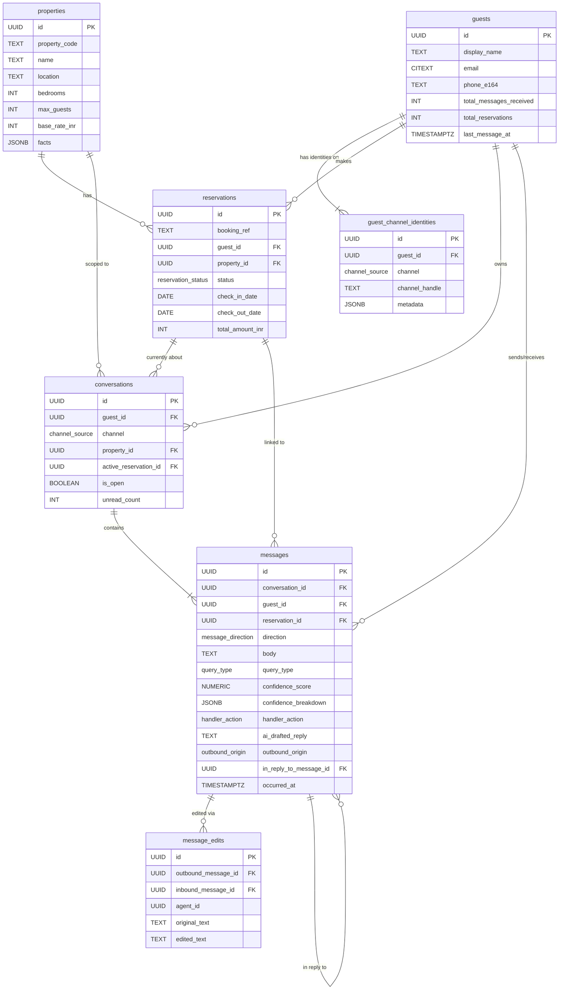

<div align="center">

# Nistula Guest Message Handler

**An AI-powered concierge that normalises guest messages from every channel, classifies the intent, drafts a reply with Claude, and routes each response through a deterministic confidence-scoring pipeline.**

[](https://www.python.org/)
[](https://fastapi.tiangolo.com/)
[](https://docs.pydantic.dev/)
[](https://www.uvicorn.org/)
[](https://www.anthropic.com/)
[](https://www.postgresql.org/)
[](https://www.openapis.org/)
[](#testing)
[](LICENSE)

[Quick Start](#quick-start) · [Architecture](#architecture) · [API](#api) · [Confidence Scoring](#confidence-scoring) · [Schema](#database-schema)

</div>

---


## Overview

Nistula receives guest messages across **WhatsApp**, **Booking.com**, **Airbnb**, **Instagram**, and direct channels. This service is the brain that decides, for every incoming message:

| Step | Stage | What happens |
|---|--------|---------------|
| 1 | Ingest | Webhook accepts a channel-specific payload at `POST /webhook/message` |
| 2 | Normalize | Channel quirks stripped — all messages collapse to one internal schema |
| 3 | Classify | Rule-based scorer assigns one of six query types (`complaint`, `pre_sales_availability`, etc.) |
| 4 | Draft | Claude generates a contextual reply grounded in property facts |
| 5 | Score | Four-signal confidence pipeline produces a `0.00 – 1.00` score |
| 6 | Route | Score and policy maps to one of: `auto_send` · `agent_review` · `escalate` |
---

## Architecture

```mermaid
flowchart LR
    A[Guest message<br/>WhatsApp / Booking.com /<br/>Airbnb / Instagram / Direct] -->|POST /webhook/message| B[FastAPI<br/>endpoint]
    B --> C[Pydantic<br/>validation]
    C --> D[Normaliser<br/>InboundMessage → UnifiedMessage]
    D --> E[Classifier<br/>6 query types<br/>+ ambiguity margin]
    E --> F[Property<br/>context]
    F --> G[Claude API<br/>claude-sonnet-4]
    G --> H[Confidence<br/>scorer]
    H --> I{Action<br/>router}
    I -->|≥ 0.85| J[auto_send]
    I -->|0.60 – 0.85| K[agent_review]
    I -->|< 0.60 OR complaint| L[escalate]

    style A fill:#F1F7EB,stroke:#4A8C2F,color:#0F1F0A
    style B fill:#FFFFFF,stroke:#D9E5CE,color:#0F1F0A
    style D fill:#FFFFFF,stroke:#D9E5CE,color:#0F1F0A
    style E fill:#FFFFFF,stroke:#D9E5CE,color:#0F1F0A
    style F fill:#E9FFDB,stroke:#4A8C2F,color:#0F1F0A
    style G fill:#E9FFDB,stroke:#4A8C2F,color:#0F1F0A
    style H fill:#FFFFFF,stroke:#D9E5CE,color:#0F1F0A
    style I fill:#FEF3C7,stroke:#92400E,color:#0F1F0A
    style J fill:#DCFCE7,stroke:#166534,color:#0F1F0A
    style K fill:#FEF3C7,stroke:#92400E,color:#0F1F0A
    style L fill:#FEE2E2,stroke:#991B1B,color:#0F1F0A
```



Each stage lives in its own module (`src/normalizer.py`, `src/classifier.py`, `src/claude_client.py`, `src/confidence.py`) — small, testable, swappable.

---

## Quick Start

```bash
# 1. Clone
git clone https://github.com/<your-user>/nistula-technical-assessment.git
cd nistula-technical-assessment

# 2. Set up the virtualenv
python3 -m venv .venv && source .venv/bin/activate

# 3. Install deps
pip install -r requirements.txt

# 4. Configure your API key
cp .env.example .env
# Edit .env and paste your Anthropic key:
#   ANTHROPIC_API_KEY=sk-ant-api03-...

# 5. Run the server
uvicorn src.main:app --reload --port 8000

# 6. Open the dashboard
open http://localhost:8000
```

Test without an API key (Claude is mocked):

```bash
pytest -v
# ============================== 21 passed in 1.05s ===============================
```

---

## API

### `POST /webhook/message`

#### Request

```json
{
  "source": "whatsapp",
  "guest_name": "Rahul Sharma",
  "message": "Is the villa available from April 20 to 24? What is the rate for 2 adults?",
  "timestamp": "2026-05-05T10:30:00Z",
  "booking_ref": "NIS-2024-0891",
  "property_id": "villa-b1"
}
```

#### Normalised internal schema

After the normaliser runs, every message regardless of source looks like this internally:

```json
{
  "message_id": "8c0d1a4d-2c0e-4f7d-9c0d-87f4a1d3b9e2",
  "source": "whatsapp",
  "guest_name": "Rahul Sharma",
  "message_text": "Is the villa available from April 20 to 24? What is the rate for 2 adults?",
  "timestamp": "2026-05-05T10:30:00Z",
  "booking_ref": "NIS-2024-0891",
  "property_id": "villa-b1",
  "query_type": "pre_sales_availability"
}
```

This proves the normalisation step actually transforms the payload channel-specific quirks (Booking.com's nested `customer` block, Instagram's `sender_id`, etc.) get collapsed into one shape before anything else touches it.

#### Response

```json
{
  "message_id": "8c0d1a4d-2c0e-4f7d-9c0d-87f4a1d3b9e2",
  "query_type": "pre_sales_availability",
  "drafted_reply": "Hi Rahul! Great news — Villa B1 is available from April 20 to 24. For 2 adults the rate is INR 18,000 per night (the base rate covers up to 4 guests), so 4 nights would be INR 72,000. Let me know if you'd like to confirm and I'll send the booking link.",
  "confidence_score": 0.91,
  "action": "auto_send",
  "confidence_breakdown": {
    "classifier_certainty": 0.92,
    "context_completeness": 1.0,
    "message_clarity": 0.95,
    "claude_self_rating": 0.95,
    "raw_score": 0.94,
    "final_score": 0.91,
    "caps_applied": [],
    "action": "auto_send"
  }
}
```

### Interactive API docs

FastAPI auto-generates a full OpenAPI specification. Visit:

```
http://localhost:8000/docs         ← Swagger UI (try-it-out)
http://localhost:8000/redoc        ← ReDoc (read-friendly)
http://localhost:8000/openapi.json ← raw OpenAPI 3.1 spec
```

---

## Confidence Scoring

Every reply is scored deterministically so the same input always produces the same score. The score is a **weighted blend of four independent signals**, plus three **hard caps** for high-risk cases.

### The four signals

| Weight | Signal | What it measures |
|:---:|---|---|
| `0.25` | `classifier_certainty` | How decisively the rules picked one query type (margin between winner and runner-up). |
| `0.20` | `context_completeness` | Do we have the data to answer? Known `property_id` is worth 0.6; `booking_ref` is worth 0.4 (only when the query type needs it). |
| `0.20` | `message_clarity` | Heuristic readability — length sweet spot, no hedging words, no stacked questions. |
| `0.35` | `claude_self_rating` | Claude's own 0–1 quality rating it appended to the draft. The strongest signal — it also captures hallucination risk. |

```
raw_score = Σ (weight × signal)
```

### The three hard caps

| Trigger | Cap | Reason |
|---|:---:|---|
| `query_type == complaint` | **0.55** | A complaint is never auto-sendable — policy, not probability. |
| `property_id` unknown / missing | **0.75** | Without context, even a confident reply could be factually wrong. |
| `claude_self_rating < 0.40` | **0.55** | Claude itself thinks the reply is thin — don't push past agent review. |

### Action mapping

| `final_score` | `action` |
|---|---|
| ≥ 0.85 | `auto_send` |
| 0.60 – 0.85 | `agent_review` |
| < 0.60 | `escalate` |
| **Any complaint** | **`escalate` (regardless of score)** |

### Worked example — why is this reply 0.91?

> **Inbound:** "Is the villa available from April 20 to 24? What is the rate for 2 adults?"

```
Signal                  Weight   Raw Value   Weighted
─────────────────────────────────────────────────────
classifier_certainty    0.25  ×  0.92    =   0.230
context_completeness    0.20  ×  1.00    =   0.200
message_clarity         0.20  ×  0.95    =   0.190
claude_self_rating      0.35  ×  0.95    =   0.333
─────────────────────────────────────────────────────
RAW SCORE                                    0.953

Caps applied                                 (none)
FINAL SCORE                                  0.91   →   auto_send
```

### Worked example — the 3am complaint

> **Inbound:** "There is no hot water and we have guests arriving for breakfast in 4 hours. This is unacceptable. I want a refund for tonight."

```
Signal                  Weight   Raw Value   Weighted
─────────────────────────────────────────────────────
classifier_certainty    0.25  ×  1.00    =   0.250
context_completeness    0.20  ×  1.00    =   0.200
message_clarity         0.20  ×  0.85    =   0.170
claude_self_rating      0.35  ×  0.70    =   0.245
─────────────────────────────────────────────────────
RAW SCORE                                    0.865

Caps applied            complaint_cap     →  0.55
FINAL SCORE                                  0.55   →   escalate
```

**This is exactly the kind of pattern complaints must follow** — a complaint message that *looks* answerable still gets routed to a human because the policy is encoded in the cap, not in the model's judgement.

### Complaint escalation — enforced in code

```python
# src/confidence.py
if msg.query_type == QueryType.COMPLAINT:
    action = Action.ESCALATE                              # always
elif final >= THRESH_AUTO_SEND:
    action = Action.AUTO_SEND
elif final >= THRESH_AGENT_REVIEW:
    action = Action.AGENT_REVIEW
else:
    action = Action.ESCALATE
```

And there's a hard cap that prevents the score from ever exceeding `0.55` for a complaint, so the badge UI also reflects the elevated risk. Both layers — score *and* action — must agree before anything can ever auto-send.

The full breakdown ships in every response under `confidence_breakdown`, so on-call engineers and reviewers can always answer "why did this message land here?" without digging through logs.

---

## Processing Logs

Every request produces three structured log lines so you can trace the full pipeline:

```
2026-05-12 03:00:14 |  INFO  | nistula | Inbound | source=whatsapp guest=Vikram Bose property=villa-b1 msg='There is no hot water and we have guests arriving for breakfast in 4 hours.'
2026-05-12 03:00:14 |  INFO  | nistula | Classified | id=8c0d1a4d-2c0e-4f7d-9c0d-87f4a1d3b9e2 query_type=complaint margin=6.00 matches=4
2026-05-12 03:00:16 |  INFO  | nistula | Scored | id=8c0d1a4d-2c0e-4f7d-9c0d-87f4a1d3b9e2 final=0.55 action=escalate caps=['complaint_cap']
```

And for a clean pre-sales enquiry:

```
2026-05-12 10:30:00 |  INFO  | nistula | Inbound | source=whatsapp guest=Rahul Sharma property=villa-b1 msg='Is the villa available from April 20 to 24?'
2026-05-12 10:30:00 |  INFO  | nistula | Classified | id=4a1b3c5d-7e9f-4a2b-9c3d-1e5f7a9b0c2d query_type=pre_sales_availability margin=4.00 matches=3
2026-05-12 10:30:02 |  INFO  | nistula | Scored | id=4a1b3c5d-7e9f-4a2b-9c3d-1e5f7a9b0c2d final=0.91 action=auto_send caps=[]
```

The log format is set in `src/main.py`:

```python
logging.basicConfig(
    level=os.getenv("LOG_LEVEL", "INFO"),
    format="%(asctime)s | %(levelname)-7s | %(name)s | %(message)s",
)
```

In production this would feed JSON to a log aggregator (Loki, Datadog, CloudWatch) so we can build dashboards on `query_type × action × hour`.

---

## Database Schema

The full Postgres schema lives in [`schema.sql`](schema.sql) — **7 tables**, **6 enums**, **13 indexes**, **1 ops view**. Designed for PostgreSQL 14+ and validated against the real Postgres grammar.



### Why the schema looks this way

| Decision | Why |
|---|---|
| `guests` separated from `guest_channel_identities` | Adding a new channel (Telegram, RCS) becomes a one-line migration instead of a destructive `ALTER TABLE`. Cross-channel merging is one `UPDATE` on the identities table. |
| AI metadata lives **on the inbound message row** | One row = one decision. `query_type`, `confidence_score`, `confidence_breakdown`, and the draft itself all sit next to the message they apply to. |
| `outbound_origin` on outbound rows | Records whether the sent text was `ai_auto_sent`, `ai_agent_sent` (drafted + edited), or `agent_authored` (no AI). |
| CHECK constraints by direction | The DB itself enforces that AI fields only exist on inbound rows. No app-layer trust required. |
| Soft delete (`deleted_at`) | Operational tables never lose history — important for both audits and ML training data. |

See [`schema.sql`](schema.sql) for the full DDL plus a paragraph on the hardest design decision.

---

## Project Structure

```
nistula-technical-assessment/
├── README.md                  ← you are here
├── .env.example               ← required env vars, no real keys
├── .gitignore
├── requirements.txt
├── schema.sql                 ← PostgreSQL DDL + design notes
├── thinking.md                ← written answers (3am hot water scenario)
├── src/
│   ├── __init__.py
│   ├── main.py                ← FastAPI app + routes + error handling
│   ├── models.py              ← Pydantic schemas + enums
│   ├── normalizer.py          ← inbound → unified
│   ├── classifier.py          ← rule-based query classification
│   ├── claude_client.py       ← async Anthropic wrapper + self-rating parse
│   ├── confidence.py          ← multi-signal scorer + action mapper
│   └── property_context.py    ← mock Villa B1 facts for the prompt
├── static/
│   └── index.html             ← operational dashboard (root route)
└── tests/
    ├── test_classifier.py     ← 7 tests, all 6 query types covered
    ├── test_confidence.py     ← 6 tests, signal logic + caps
    └── test_webhook.py        ← 8 tests, end-to-end with mocked Claude
```

---

## Tech Stack

| Layer | Choice | Why |
|---|---|---|
| Framework | **FastAPI** | Async, Pydantic validation, free OpenAPI docs |
| Language | **Python 3.10+** | Anthropic SDK, ecosystem maturity |
| AI | **Claude Sonnet 4** | Best-in-class instruction following + low hallucination on grounded prompts |
| Validation | **Pydantic 2** | Type-safe schemas at every API boundary |
| Testing | **pytest** + **httpx TestClient** | Standard, fast, mocks Claude cleanly |
| Database | **PostgreSQL 14+** | (schema designed in Part 2) |
| Frontend | **Vanilla HTML/CSS/JS** | One file, dark + light mode, zero build step |

No frameworks for the dashboard — every line of HTML, CSS, and JS is in [`static/index.html`](static/index.html). Zero npm, zero build, drops onto any FastAPI server unchanged.

---

## Testing

```bash
pytest -v
```

21 tests covering:

- **Classifier** (7 tests) — every query type from the brief plus a fallback
- **Confidence** (6 tests) — each signal, each cap, action mapping
- **Webhook** (8 tests) — every preset payload end-to-end, plus 422 validation, plus the `/health` endpoint

Claude is mocked in tests, so the suite runs in ~1 second with no API key needed.

```
tests/test_classifier.py::test_availability                                 PASSED
tests/test_classifier.py::test_pricing                                      PASSED
tests/test_classifier.py::test_checkin                                      PASSED
tests/test_classifier.py::test_special_request                              PASSED
tests/test_classifier.py::test_complaint                                    PASSED
tests/test_classifier.py::test_general                                      PASSED
tests/test_classifier.py::test_empty_message_falls_back                     PASSED
tests/test_confidence.py::test_clear_checkin_scores_high_and_auto_sends     PASSED
tests/test_confidence.py::test_complaint_is_always_escalated                PASSED
tests/test_confidence.py::test_missing_property_context_caps_score          PASSED
tests/test_confidence.py::test_low_claude_self_rating_caps_score            PASSED
tests/test_confidence.py::test_ambiguous_message_goes_to_agent_review       PASSED
tests/test_confidence.py::test_breakdown_is_serialisable                    PASSED
tests/test_webhook.py::test_availability_payload_returns_200_and_auto_sends PASSED
tests/test_webhook.py::test_checkin_payload                                 PASSED
tests/test_webhook.py::test_complaint_payload_always_escalates              PASSED
tests/test_webhook.py::test_special_request_payload                         PASSED
tests/test_webhook.py::test_general_enquiry_payload                         PASSED
tests/test_webhook.py::test_invalid_source_rejected                         PASSED
tests/test_webhook.py::test_empty_message_rejected                          PASSED
tests/test_webhook.py::test_health_endpoint                                 PASSED

============================== 21 passed in 1.05s ===============================
```

---

## Error Handling

| Failure | HTTP | Behaviour |
|---|:---:|---|
| Malformed / invalid payload | 422 | Pydantic validation message |
| Empty / whitespace-only message | 422 | Custom validator rejects |
| Unknown `source` value | 422 | Enum rejection |
| Claude API timeout | 504 | Logged server-side, generic message to caller |
| Claude API error | 502 | Logged, error type returned without leaking internals |
| Missing `ANTHROPIC_API_KEY` | 500 | Clear actionable error |
| Anything else | 500 | Caught by `unhandled_exception_handler` — stack trace logged, never leaked to caller |

---

## Design Decisions Worth Knowing

<details>
<summary><b>Why a hybrid classifier (rules first, Claude as fallback)?</b></summary>

For 10k messages/day, rule-based classification is two orders of magnitude cheaper and faster than calling Claude. Hospitality queries are narrow enough that good keywords cover ~95% of cases. The classifier returns an ambiguity margin so genuinely unclear messages still surface to a human via the confidence scorer.

</details>

<details>
<summary><b>Why ask Claude to self-rate its own draft?</b></summary>

A trailing `[SELF_RATING: X.XX]` tag adds essentially zero latency (one extra token), no extra model call, and gives a quality signal the rule-based scorer cannot produce. The system prompt is explicit about when 0.9+ is earned (every fact must come from supplied context). Parsed off the end of the reply with a small regex, defaulting to 0.5 if missing.

</details>

<details>
<summary><b>Why hard caps for policy instead of soft weights?</b></summary>

Complaints, missing context, and low self-rating are not probability events — they're business rules. Encoding them as caps keeps the weight-tuning surface small and makes the policy easy to audit. A complaint should *never* be auto-sendable, no matter what the model thinks.

</details>

<details>
<summary><b>Why return the whole confidence breakdown in every response?</b></summary>

It would have been cleaner to hide it. I kept it because it's the difference between a black-box auto-send decision and one a human can sanity-check at 3am. Reviewers, on-call engineers, and the agent dashboard all benefit.

</details>

---


<div align="center">

**Made by Prateek Raushan for Nistula**

</div>
